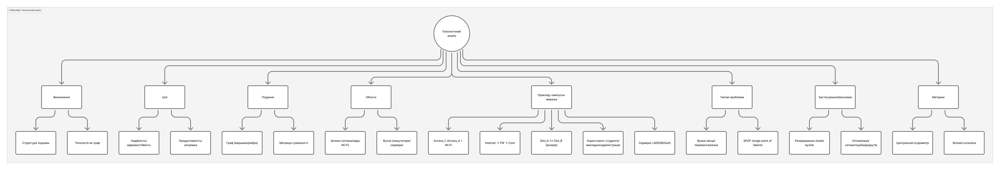
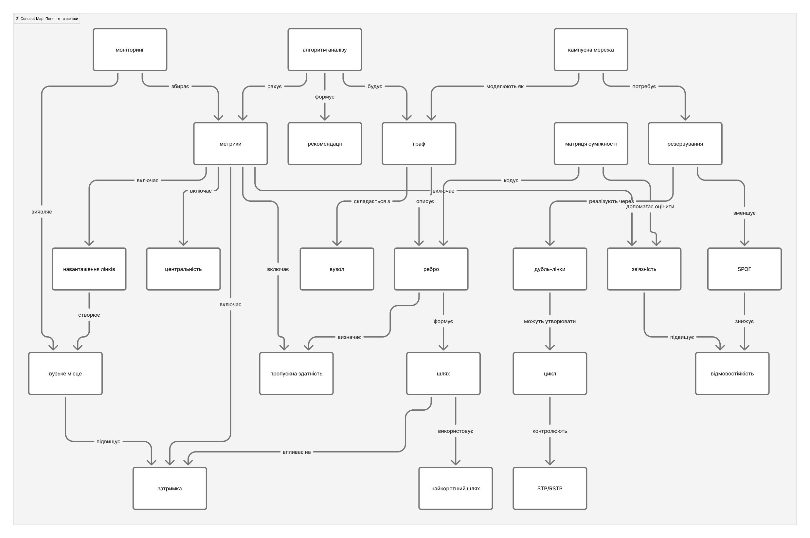
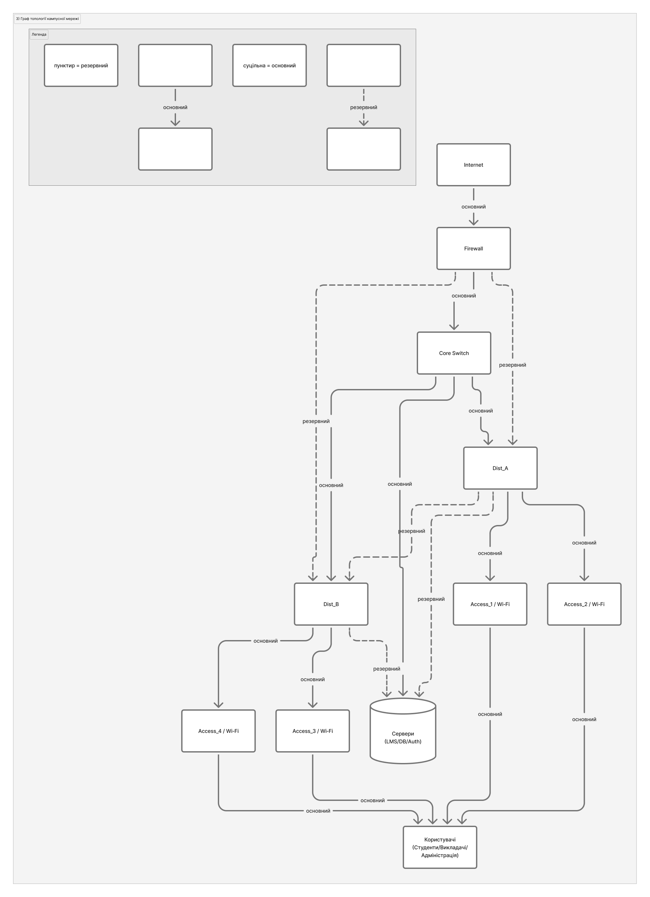
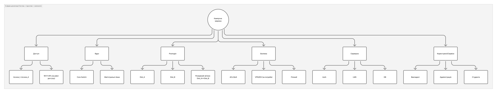
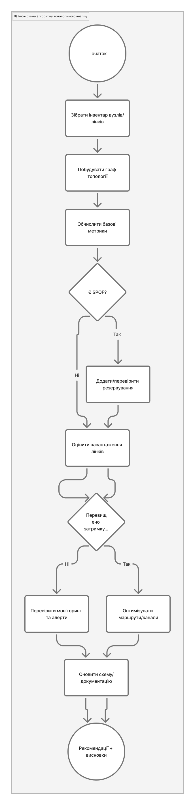

# Практичне завдання №2 з дисципліни “Системний аналіз”

## Тема: Топологічний аналіз (варіант 13)

**Студент:** Захар Єрмолович Максимович

---

## 1. Мета роботи

Опрацювати теоретичні основи **топологічного аналізу**, дослідити прикладну систему у вигляді графа (вузли/зв’язки), представити структуру знань у вигляді **не менше 8 різних візуальних представлень**, включно з **діаграмою Ісікави**, та оформити результати у звіті.

---

## 2. Завдання роботи

1. Опрацювати теоретичний матеріал за темою та поглибити знання з додаткових джерел.
2. Провести дослідження і структурувати інформацію з візуальним представленням (8+ візуалізацій).
3. Оформити звіт (опис, інструменти, скріншоти, посилання, джерела).

---

## 3. Об’єкт дослідження (приклад системи)

**Кампусна мережа університету**:  
Internet → Firewall → Core Switch → два Distribution Switch (Dist_A, Dist_B) з резервним зв’язком між ними → Access Switches (Access_1..Access_4) / Wi-Fi APs → Сервери (LMS, DB, Auth) → Користувачі (Студенти, Викладачі, Адміністрація).

---

## 4. Короткі теоретичні відомості

**Топологія мережі** — це спосіб, у який **вузли** (nodes) та **ребра/зв’язки** (edges) розташовані й з’єднані в межах мережі; топологічні властивості можуть описувати як всю мережу, так і окремі елементи. ([EMBL-EBI](https://www.ebi.ac.uk/training/online/courses/network-analysis-of-protein-interaction-data-an-introduction/introduction-to-graph-theory/graph-theory-network-topology/))

У топологічному аналізі система подається як **граф**, де оцінюють:

- **зв’язність** (чи існують шляхи між вузлами),
- **найкоротші маршрути** і **діаметр графа** (найдовший з найкоротших шляхів), ([География транспортных систем](https://transportgeography.org/contents/methods/graph-theory-measures-indices/))
- **центральність** (наприклад, degree/close/betweenness), щоб визначити критичні вузли-хаби або “мости” у потоках даних. ([Википедия](https://en.wikipedia.org/wiki/Centrality))

Для формалізації структури графа застосовують **матрицю суміжності** — квадратну матрицю, де елемент показує наявність прямого зв’язку між вузлами (у простому неваговому графі — 0/1). ([Википедия](https://en.wikipedia.org/wiki/Adjacency_matrix))

Для пошуку причин проблем (наприклад, “затримки/відмови”) ефективною є **діаграма Ісікави** (fishbone/cause-and-effect), що структурує можливі причини за категоріями. ([asq.org](https://asq.org/quality-resources/fishbone?srsltid=AfmBOooWyCIHVu4zE5wUrQyrBq735bzlVwQVWkDPXodQl8aXkgZPztBC))

---

## 5. Використані інструменти

- **Figma / FigJam** — середовище для створення mind map, діаграм, схем, таблиць та зв’язків між елементами (конектори, форми, шаблони). ([Figma](https://www.figma.com/figjam/mind-map/?utm_source=chatgpt.com "Build online mind maps in FigJam for free"))
- **OpenAI (ChatGPT)** — генерація структури діаграм (план вузлів, логіка зв’язків, категорії причин, метрики), після чого візуалізації були відтворені у FigJam.

**Примітка:** усі 8 візуалізацій виконані **в одному стилі та в межах однієї системи**, щоб діаграми логічно доповнювали одна одну.

---

# 6. Результати: 8 візуалізацій

## 6.1. Завдання 1 — Mind Map “Топологічний аналіз”

Мета: структурувати ключові поняття теми (визначення, об’єкти, метрики, задачі, приклади застосування) та прив’язати їх до кампусної мережі.


[ПОСИЛАННЯ НА ОРИГІНАЛ FIGJAM](https://www.figma.com/board/zPROzvk3z9NlfvLtPApEtA/%D0%9F%D1%80%D0%B0%D0%BA%D1%82%D0%B8%D1%87%D0%BD%D0%B5-%E2%84%962-%E2%80%94-%D0%A2%D0%BE%D0%BF%D0%BE%D0%BB%D0%BE%D0%B3%D1%96%D1%87%D0%BD%D0%B8%D0%B9-%D0%B0%D0%BD%D0%B0%D0%BB%D1%96%D0%B7--%D0%BA%D0%B0%D0%BC%D0%BF%D1%83%D1%81%D0%BD%D0%B0-%D0%BC%D0%B5%D1%80%D0%B5%D0%B6%D0%B0-?node-id=1-87&t=dTVLW8woVVDbb1Ma-4)

---

## 6.2. Завдання 2 — Concept Map “Поняття та зв’язки”

Мета: показати **семантичні зв’язки** між поняттями (вузол, ребро, шлях, зв’язність, цикл, центральність, вузькі місця, резервування, відмовостійкість, моніторинг).


[ПОСИЛАННЯ НА ОРИГІНАЛ FIGJAM](https://www.figma.com/board/zPROzvk3z9NlfvLtPApEtA/%D0%9F%D1%80%D0%B0%D0%BA%D1%82%D0%B8%D1%87%D0%BD%D0%B5-%E2%84%962-%E2%80%94-%D0%A2%D0%BE%D0%BF%D0%BE%D0%BB%D0%BE%D0%B3%D1%96%D1%87%D0%BD%D0%B8%D0%B9-%D0%B0%D0%BD%D0%B0%D0%BB%D1%96%D0%B7--%D0%BA%D0%B0%D0%BC%D0%BF%D1%83%D1%81%D0%BD%D0%B0-%D0%BC%D0%B5%D1%80%D0%B5%D0%B6%D0%B0-?node-id=1-157&t=dTVLW8woVVDbb1Ma-4)

---

## 6.3. Завдання 3 — Граф топології кампусної мережі

Мета: подати систему як **граф** із 10–12 вузлів та 18–22 зв’язків, окремо виділити **резервні лінії** (пунктир/підпис “резервний”), щоб оцінити стійкість та можливі SPOF.


[ПОСИЛАННЯ НА ОРИГІНАЛ FIGJAM](https://www.figma.com/board/zPROzvk3z9NlfvLtPApEtA/%D0%9F%D1%80%D0%B0%D0%BA%D1%82%D0%B8%D1%87%D0%BD%D0%B5-%E2%84%962-%E2%80%94-%D0%A2%D0%BE%D0%BF%D0%BE%D0%BB%D0%BE%D0%B3%D1%96%D1%87%D0%BD%D0%B8%D0%B9-%D0%B0%D0%BD%D0%B0%D0%BB%D1%96%D0%B7--%D0%BA%D0%B0%D0%BC%D0%BF%D1%83%D1%81%D0%BD%D0%B0-%D0%BC%D0%B5%D1%80%D0%B5%D0%B6%D0%B0-?node-id=1-212&t=dTVLW8woVVDbb1Ma-4)

---

## 6.4. Завдання 4 — Матриця суміжності (Adjacency Matrix)

Позначення вузлів (рядки/колонки):

|Скорочення|Повна назва|Опис|
|---|---|---|
|Int|Internet|Зовнішня мережа / провайдер|
|FW|Firewall|Мережевий екран, фільтрація трафіку|
|Core|Core Switch|Ядро мережі, центральна комутація|
|DA|Dist_A|Розподільчий комутатор A|
|DB|Dist_B|Розподільчий комутатор B|
|A1|Access_1 / Wi-Fi|Комутатор доступу + точки Wi-Fi (зона 1)|
|A2|Access_2 / Wi-Fi|Комутатор доступу + точки Wi-Fi (зона 2)|
|A3|Access_3 / Wi-Fi|Комутатор доступу + точки Wi-Fi (зона 3)|
|A4|Access_4 / Wi-Fi|Комутатор доступу + точки Wi-Fi (зона 4)|
|Srv|Сервери (LMS, DB, Auth)|Критичні інформаційні сервіси університету|
|Usr|Користувачі|Студенти, викладачі та адміністрація|

### Матриця суміжності

| Int  | FW  | Core | DA  | DB  | A1  | A2  | A3  | A4  | Srv | Usr |     |
| ---- | --- | ---- | --- | --- | --- | --- | --- | --- | --- | --- | --- |
| Int  | 0   | 1    | 0   | 0   | 0   | 0   | 0   | 0   | 0   | 0   | 0   |
| FW   | 1   | 0    | 1   | 1   | 1   | 0   | 0   | 0   | 0   | 0   | 0   |
| Core | 0   | 1    | 0   | 1   | 1   | 0   | 0   | 0   | 0   | 1   | 0   |
| DA   | 0   | 1    | 1   | 0   | 1   | 1   | 1   | 0   | 0   | 1   | 0   |
| DB   | 0   | 1    | 1   | 1   | 0   | 0   | 0   | 1   | 1   | 1   | 0   |
| A1   | 0   | 0    | 0   | 1   | 0   | 0   | 0   | 0   | 0   | 0   | 1   |
| A2   | 0   | 0    | 0   | 1   | 0   | 0   | 0   | 0   | 0   | 0   | 1   |
| A3   | 0   | 0    | 0   | 0   | 1   | 0   | 0   | 0   | 0   | 0   | 1   |
| A4   | 0   | 0    | 0   | 0   | 1   | 0   | 0   | 0   | 0   | 0   | 1   |
| Srv  | 0   | 0    | 1   | 1   | 1   | 0   | 0   | 0   | 0   | 0   | 0   |
| Usr  | 0   | 0    | 0   | 0   | 0   | 1   | 1   | 1   | 1   | 0   | 0   |

[ПОСИЛАННЯ НА ОРИГІНАЛ FIGJAM](https://www.figma.com/board/zPROzvk3z9NlfvLtPApEtA/%D0%9F%D1%80%D0%B0%D0%BA%D1%82%D0%B8%D1%87%D0%BD%D0%B5-%E2%84%962-%E2%80%94-%D0%A2%D0%BE%D0%BF%D0%BE%D0%BB%D0%BE%D0%B3%D1%96%D1%87%D0%BD%D0%B8%D0%B9-%D0%B0%D0%BD%D0%B0%D0%BB%D1%96%D0%B7--%D0%BA%D0%B0%D0%BC%D0%BF%D1%83%D1%81%D0%BD%D0%B0-%D0%BC%D0%B5%D1%80%D0%B5%D0%B6%D0%B0-?node-id=1-252&t=dTVLW8woVVDbb1Ma-4)

---

## 6.5. Завдання 5 — Дерево декомпозиції

Мета: показати систему ієрархічно: **система → підсистеми → компоненти**, щоб було видно, які елементи входять до ядра, розподілу, доступу, серверної частини та безпеки.


[ПОСИЛАННЯ НА ОРИГІНАЛ FIGJAM](https://www.figma.com/board/zPROzvk3z9NlfvLtPApEtA/%D0%9F%D1%80%D0%B0%D0%BA%D1%82%D0%B8%D1%87%D0%BD%D0%B5-%E2%84%962-%E2%80%94-%D0%A2%D0%BE%D0%BF%D0%BE%D0%BB%D0%BE%D0%B3%D1%96%D1%87%D0%BD%D0%B8%D0%B9-%D0%B0%D0%BD%D0%B0%D0%BB%D1%96%D0%B7--%D0%BA%D0%B0%D0%BC%D0%BF%D1%83%D1%81%D0%BD%D0%B0-%D0%BC%D0%B5%D1%80%D0%B5%D0%B6%D0%B0-?node-id=1-323&t=dTVLW8woVVDbb1Ma-4)

---

## 6.6. Завдання 6 — Блок-схема алгоритму топологічного аналізу

Мета: формалізувати процес аналізу (побудова графа → збір даних → пошук SPOF/вузьких місць → аналіз метрик → рекомендації) з мінімум двома розгалуженнями “Так/Ні”.


[ПОСИЛАННЯ НА ОРИГІНАЛ FIGJAM](https://www.figma.com/board/zPROzvk3z9NlfvLtPApEtA/%D0%9F%D1%80%D0%B0%D0%BA%D1%82%D0%B8%D1%87%D0%BD%D0%B5-%E2%84%962-%E2%80%94-%D0%A2%D0%BE%D0%BF%D0%BE%D0%BB%D0%BE%D0%B3%D1%96%D1%87%D0%BD%D0%B8%D0%B9-%D0%B0%D0%BD%D0%B0%D0%BB%D1%96%D0%B7--%D0%BA%D0%B0%D0%BC%D0%BF%D1%83%D1%81%D0%BD%D0%B0-%D0%BC%D0%B5%D1%80%D0%B5%D0%B6%D0%B0-?node-id=1-360&t=dTVLW8woVVDbb1Ma-4)

---

## 6.7. Завдання 7 — Таблиця метрик/критеріїв топологічного аналізу

|Метрика|Що означає|Як оцінюють|Як трактувати|Приклад для кампусу|
|---|---|---|---|---|
|Зв’язність|чи є шлях між усіма вузлами|компоненти зв’язності, k-connectivity|1 компонент = ок, більше = розрив|відмова одного Access не ізолює корпус|
|Найкоротший шлях|мінімальний маршрут між вузлами|BFS/Dijkstra (кроки/ваги)|менше = швидше|Internet→FW→Core→Srv|
|Діаметр|найдовший з найкоротших шляхів|max(shortest paths)|менше = краща “компактність”|найдальший Access до серверів|
|Ступінь вузла|кількість прямих лінків|degree(v)|високий = вузол-хаб|Core має найбільший ступінь|
|Центральність (betweenness)|наскільки вузол “транзитний”|betweenness centrality|високий = критичний|Core/Dist несуть основні потоки|
|Вузькі місця|де обмеження пропускної здатності|utilization, queue/drop|треба розширювати/балансувати|аплінк Dist→Core у піки|
|SPOF|одиночна точка відмови|аналіз критичних вузлів/лінків|треба усунути|один Firewall без HA|
|Резервування|наявність альтернативних шляхів|кількість незалежних шляхів|більше = вища SLA|Dist_A↔Dist_B резервний лінк|
|Щільність графа|“наскільки багато” зв’язків|2E/(N(N−1))|вище = гнучкіше, але складніше|порівняння міжкорпусних схем|
|Кластери|групи тісно зв’язаних вузлів|community detection|допомагає сегментації|VLAN/підмережі по факультетах|
|Стійкість до відмов|робота після N−1 відмови|симуляція відмов, тест failover|витримує = добре|відмова Dist_A без втрати доступу|
|Навантаження лінків|поточні/пікові потоки|SNMP, NetFlow/sFlow|планування capacity|вечірні піки Wi-Fi на Access_2|

[ПОСИЛАННЯ НА ОРИГІНАЛ FIGJAM](https://www.figma.com/board/zPROzvk3z9NlfvLtPApEtA/%D0%9F%D1%80%D0%B0%D0%BA%D1%82%D0%B8%D1%87%D0%BD%D0%B5-%E2%84%962-%E2%80%94-%D0%A2%D0%BE%D0%BF%D0%BE%D0%BB%D0%BE%D0%B3%D1%96%D1%87%D0%BD%D0%B8%D0%B9-%D0%B0%D0%BD%D0%B0%D0%BB%D1%96%D0%B7--%D0%BA%D0%B0%D0%BC%D0%BF%D1%83%D1%81%D0%BD%D0%B0-%D0%BC%D0%B5%D1%80%D0%B5%D0%B6%D0%B0-?node-id=1-400&t=dTVLW8woVVDbb1Ma-4)

---

## 6.8. Завдання 8 — Діаграма Ісікави (Fishbone)

Мета: виконати причинно-наслідковий аналіз проблеми **“Висока затримка та періодичні відмови мережі”**. Причини згруповані за категоріями (Люди, Процеси, Обладнання/Технології, Конфігурація, Дані/Моніторинг, Середовище/Зовнішні фактори), далі деталізовані підпричинами. ([asq.org](https://asq.org/quality-resources/fishbone?srsltid=AfmBOooWyCIHVu4zE5wUrQyrBq735bzlVwQVWkDPXodQl8aXkgZPztBC&utm_source=chatgpt.com "What is a Fishbone Diagram? Ishikawa Cause & Effect ..."))


 [ПОСИЛАННЯ НА ОРИГІНАЛ FIGJAM](https://www.figma.com/board/zPROzvk3z9NlfvLtPApEtA/%D0%9F%D1%80%D0%B0%D0%BA%D1%82%D0%B8%D1%87%D0%BD%D0%B5-%E2%84%962-%E2%80%94-%D0%A2%D0%BE%D0%BF%D0%BE%D0%BB%D0%BE%D0%B3%D1%96%D1%87%D0%BD%D0%B8%D0%B9-%D0%B0%D0%BD%D0%B0%D0%BB%D1%96%D0%B7--%D0%BA%D0%B0%D0%BC%D0%BF%D1%83%D1%81%D0%BD%D0%B0-%D0%BC%D0%B5%D1%80%D0%B5%D0%B6%D0%B0-?node-id=1-533&t=dTVLW8woVVDbb1Ma-4)

---

## 7. Висновки

1. Кампусна мережа коректно подається як граф (вузли/зв’язки), що дозволяє аналізувати **зв’язність**, альтернативні маршрути, критичні вузли та потенційні вузькі місця. ([EMBL-EBI](https://www.ebi.ac.uk/training/online/courses/network-analysis-of-protein-interaction-data-an-introduction/introduction-to-graph-theory/graph-theory-network-topology))
2. За логікою структури та матриці суміжності видно потенційний **SPOF** на рівні периметру (Firewall без HA) та сегментація доступу (A1/A2 залежать від Dist_A, A3/A4 — від Dist_B), що важливо враховувати для відмовостійкості.
3. Резервний зв’язок між Dist_A та Dist_B підвищує стійкість до відмов, але для максимального SLA доцільно додатково забезпечити резервування периметру (наприклад, HA для FW) та перевірити пропускну здатність uplink-каналів у пікові періоди.
---

# 8. Список використаних додаткових джерел

```text
1) EMBL-EBI: Graph theory / network topology (визначення топології та топологічних властивостей мережі):
https://www.ebi.ac.uk/training/online/courses/network-analysis-of-protein-interaction-data-an-introduction/introduction-to-graph-theory/graph-theory-network-topology/

2) Transport Geography: Graph theory measures (діаметр графа та інші індекси):
https://transportgeography.org/contents/methods/graph-theory-measures-indices/

3) Wikipedia: Adjacency matrix (визначення матриці суміжності):
https://en.wikipedia.org/wiki/Adjacency_matrix

4) MathWorks (MATLAB): adjacency(G) (пояснення 0/1 матриці суміжності):
https://www.mathworks.com/help/matlab/ref/graph.adjacency.html

5) ASQ (American Society for Quality): Fishbone / Ishikawa diagram (призначення та користь):
https://asq.org/quality-resources/fishbone

6) IHI (Institute for Healthcare Improvement): Cause-and-effect diagram (категоризація причин):
https://www.ihi.org/library/tools/cause-and-effect-diagram

7) AhaSlides (укр.): Приклад діаграми Ісікави (пояснення та приклади):
https://ahaslides.com/uk/blog/ishikawa-diagram-example/

8) E5 (укр.): Діаграма Ішікави “риб’яча кістка” (визначення та застосування):
https://e5.ua/uk/blogpost-2/diagrama-isikavy-ryb-yacha-kistka-yak-efektyvnyj-instrument-menedzhmentu/

9) Figma: Mind maps у FigJam (опис підходу mind map):
https://www.figma.com/figjam/mind-map/

10) Figma Help Center: Connectors у FigJam (як робити зв’язки/стрілки):
https://help.figma.com/hc/en-us/articles/1500004414542-Create-diagrams-and-flows-with-connectors-in-FigJam
```

---

## 9. Додатки


[ПОСИЛАННЯ НА ДОШКУ FIGJAM](https://www.figma.com/board/zPROzvk3z9NlfvLtPApEtA/%D0%9F%D1%80%D0%B0%D0%BA%D1%82%D0%B8%D1%87%D0%BD%D0%B5-%E2%84%962-%E2%80%94-%D0%A2%D0%BE%D0%BF%D0%BE%D0%BB%D0%BE%D0%B3%D1%96%D1%87%D0%BD%D0%B8%D0%B9-%D0%B0%D0%BD%D0%B0%D0%BB%D1%96%D0%B7--%D0%BA%D0%B0%D0%BC%D0%BF%D1%83%D1%81%D0%BD%D0%B0-%D0%BC%D0%B5%D1%80%D0%B5%D0%B6%D0%B0-?node-id=0-1&p=f&t=eeyh8qiDIL4Djlpn-0)