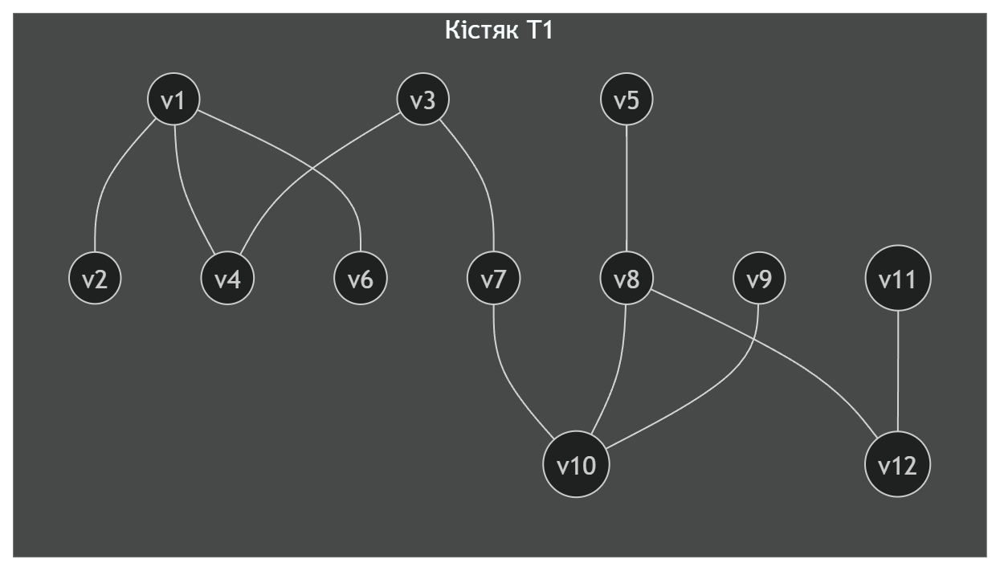
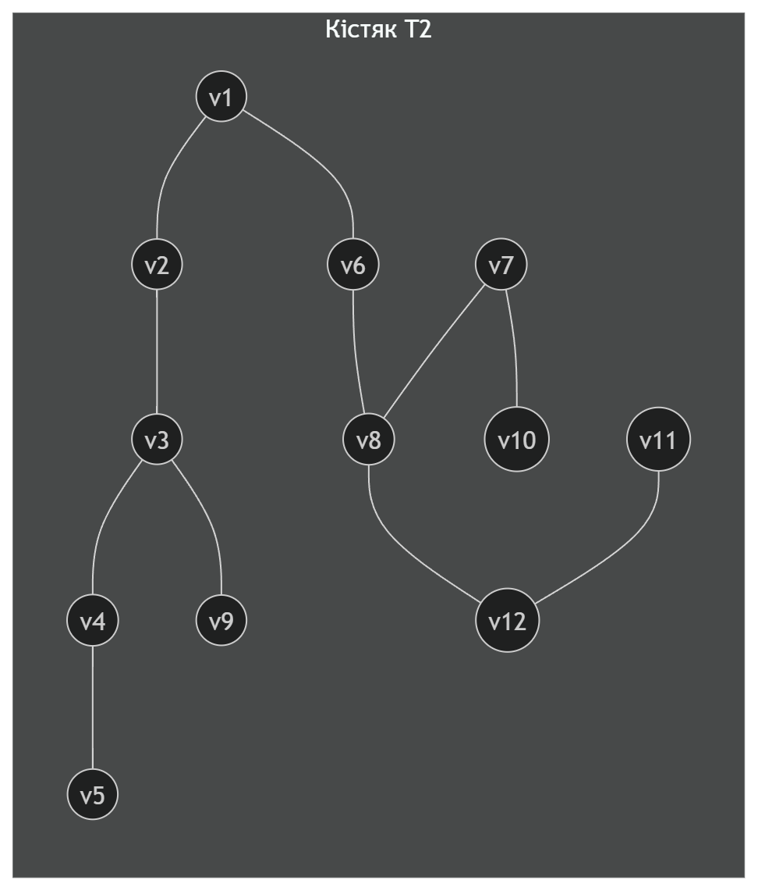
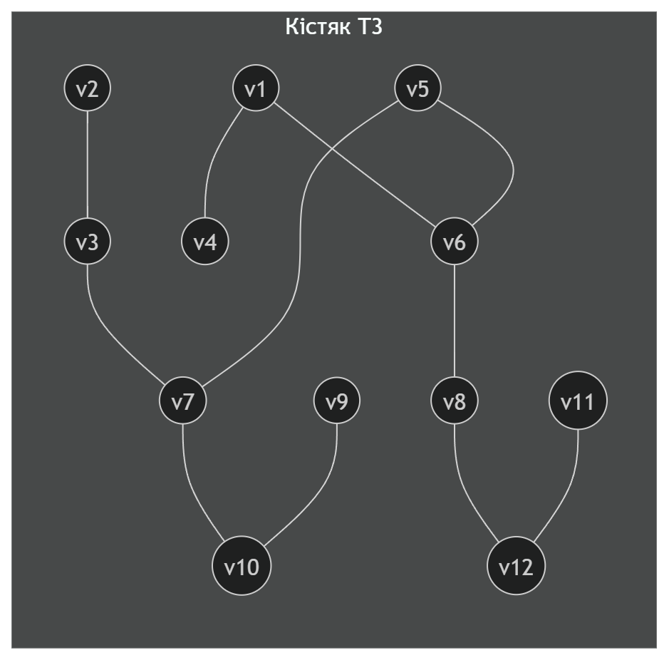
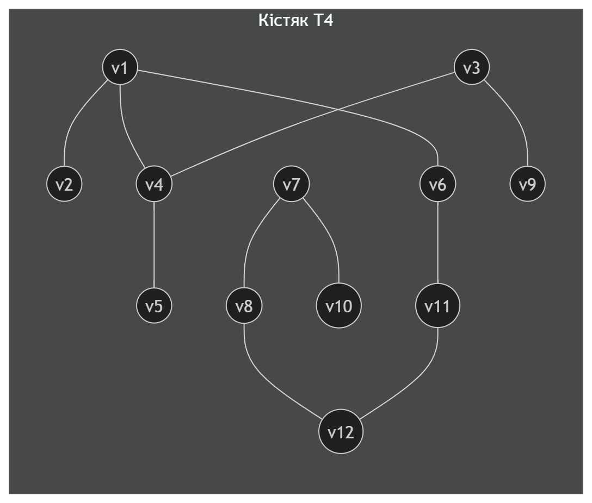
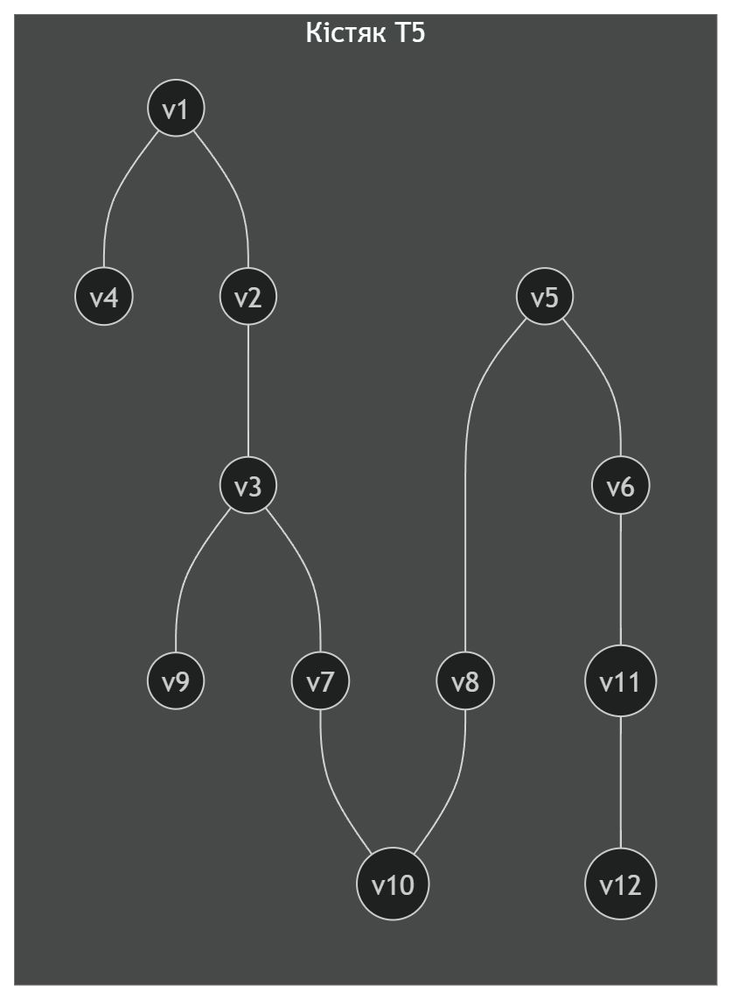
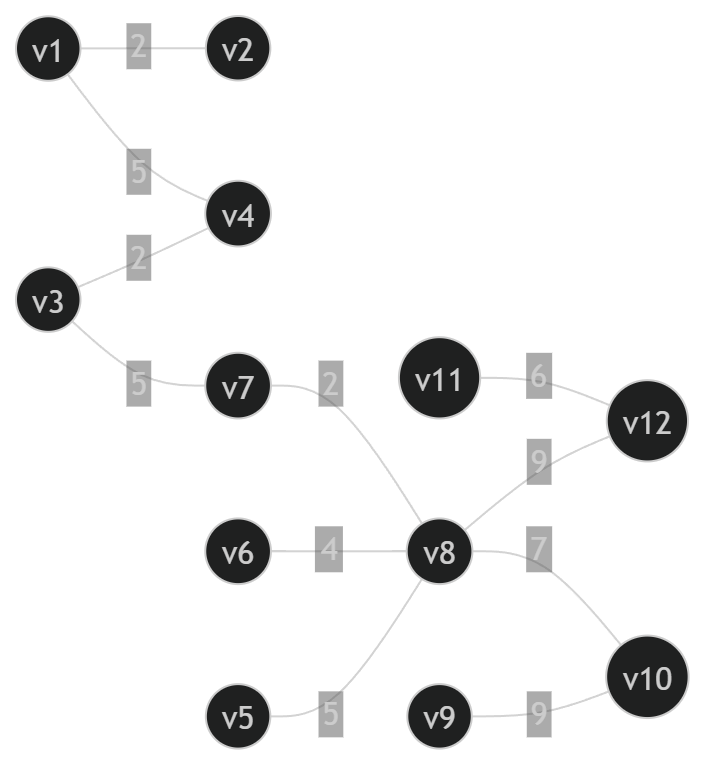
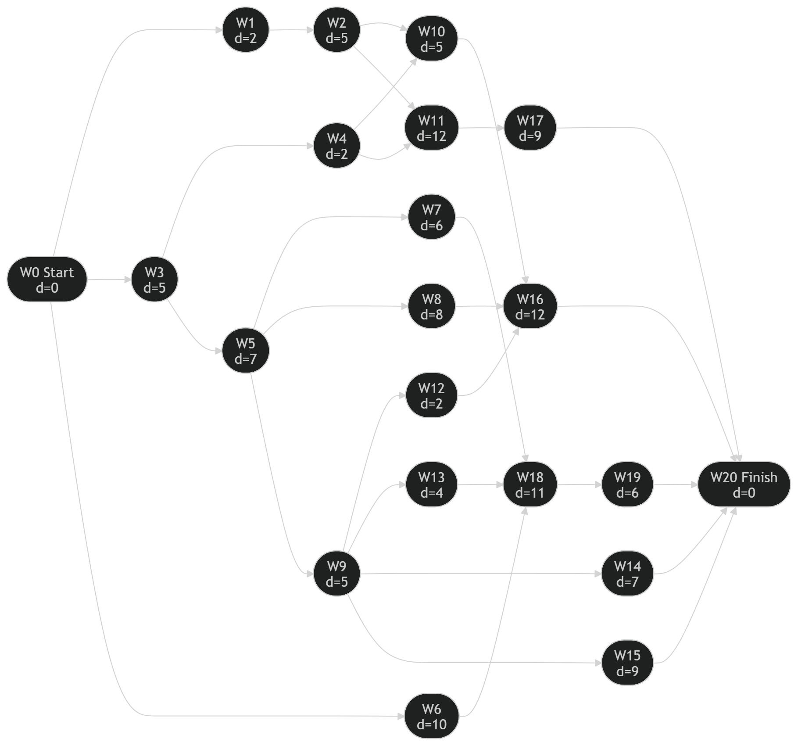
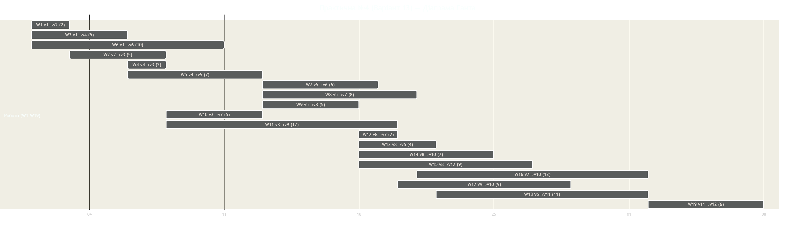
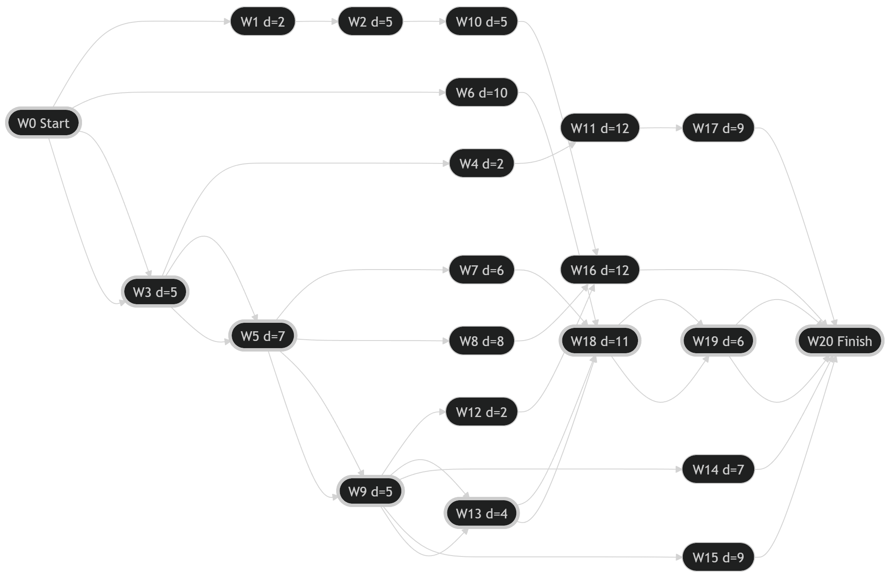

# Практична робота №4  
## Аналіз складних систем на основі теорії графів

**Виконав(ла):** _ВСТАВ ПІБ_  
**Група:** _ВСТАВ ГРУПУ_  
**Перевірив(ла):** _ВСТАВ ПІБ ВИКЛАДАЧА_  
**Дата:** _ВСТАВ ДАТУ_

---

## Вихідні дані (Варіант 13)


> У методичці в задачі 5 вимагається шлях з **v1 до v13**. У наданому зображенні видно 12 реальних вершин.  
> Щоб узгодити вимогу “v1 → v13”, у задачі 5 я ввів **фіктивну вершину v13** як “загальний фініш” та додав ребра нульової ваги: **(v10, v13)** і **(v12, v13)**. Це стандартний підхід для об’єднання декількох фіналів/подій (аналогічно до фіктивної завершальної роботи в мережевих графіках). :contentReference[oaicite:0]{index=0}

---

## Прийнята нумерація вершин v1…v12 (за розташуванням на рисунку)

- **v1** — ліва крайня (стартова)  
- **v2** — ліва верхня (на лівій “рамці”)  
- **v3** — верхня центральна  
- **v4** — ліва середня  
- **v5** — центральна  
- **v6** — нижня центральна  
- **v7** — верхня середньо-права (вузол перед правим “фінішем”)  
- **v8** — права середня (вузол-розгалуження)  
- **v9** — верхня права (малий вузол на верхньому ребрі)  
- **v10** — права крайня (верхній правий “фініш”)  
- **v11** — нижня права проміжна (на нижній горизонталі)  
- **v12** — права нижня (нижній правий “фініш”)  

---

## Mermaid-код (орієнтований ребернозважений граф v1…v12)

```mermaid
%%{init: {'flowchart': {'curve': 'basis'}}}%%
flowchart LR
  v1((v1)) -->|2| v2((v2))
  v2 -->|5| v3((v3))

  v1 -->|5| v4((v4))
  v4 -->|2| v3

  v4 -->|7| v5((v5))
  v1 -->|10| v6((v6))
  v5 -->|6| v6

  v5 -->|8| v7((v7))
  v5 -->|5| v8((v8))
  v3 -->|5| v7
  v3 -->|12| v9((v9))

  v8 -->|2| v7
  v8 -->|4| v6
  v8 -->|7| v10((v10))
  v8 -->|9| v12((v12))

  v7 -->|12| v10
  v9 -->|9| v10

  v6 -->|11| v11((v11))
  v11 -->|6| v12
````

---

# 1. Пронумерувати вершини і дуги. Записати матриці суміжності та інцидентності (орієнтований граф)

Матриця інцидентності та матриця суміжності будуються за означеннями методички. 

## 1.1 Список дуг (e1…e19) з вагами

| Дуга | Початок → Кінець | Вага |
| ---: | ---------------- | ---: |
|   e1 | v1 → v2          |    2 |
|   e2 | v2 → v3          |    5 |
|   e3 | v1 → v4          |    5 |
|   e4 | v4 → v3          |    2 |
|   e5 | v4 → v5          |    7 |
|   e6 | v1 → v6          |   10 |
|   e7 | v5 → v6          |    6 |
|   e8 | v5 → v7          |    8 |
|   e9 | v5 → v8          |    5 |
|  e10 | v3 → v7          |    5 |
|  e11 | v3 → v9          |   12 |
|  e12 | v8 → v7          |    2 |
|  e13 | v8 → v6          |    4 |
|  e14 | v8 → v10         |    7 |
|  e15 | v8 → v12         |    9 |
|  e16 | v7 → v10         |   12 |
|  e17 | v9 → v10         |    9 |
|  e18 | v6 → v11         |   11 |
|  e19 | v11 → v12        |    6 |

---

## 1.2 Матриця суміжності A (12×12) для орієнтованого графа

`a_ij` = кількість дуг з початком у vi та кінцем у vj. 

|      | v1 | v2 | v3 | v4 | v5 | v6 | v7 | v8 | v9 | v10 | v11 | v12 |
|------|----|----|----|----|----|----|----|----|----|-----|-----|-----|
| v1   | 0  | 1  | 0  | 1  | 0  | 1  | 0  | 0  | 0  | 0   | 0   | 0   |
| v2   | 0  | 0  | 1  | 0  | 0  | 0  | 0  | 0  | 0  | 0   | 0   | 0   |
| v3   | 0  | 0  | 0  | 0  | 0  | 0  | 1  | 0  | 1  | 0   | 0   | 0   |
| v4   | 0  | 0  | 1  | 0  | 1  | 0  | 0  | 0  | 0  | 0   | 0   | 0   |
| v5   | 0  | 0  | 0  | 0  | 0  | 1  | 1  | 1  | 0  | 0   | 0   | 0   |
| v6   | 0  | 0  | 0  | 0  | 0  | 0  | 0  | 0  | 0  | 0   | 1   | 0   |
| v7   | 0  | 0  | 0  | 0  | 0  | 0  | 0  | 0  | 0  | 1   | 0   | 0   |
| v8   | 0  | 0  | 0  | 0  | 0  | 1  | 1  | 0  | 0  | 1   | 0   | 1   |
| v9   | 0  | 0  | 0  | 0  | 0  | 0  | 0  | 0  | 0  | 1   | 0   | 0   |
| v10  | 0  | 0  | 0  | 0  | 0  | 0  | 0  | 0  | 0  | 0   | 0   | 0   |
| v11  | 0  | 0  | 0  | 0  | 0  | 0  | 0  | 0  | 0  | 0   | 0   | 1   |
| v12  | 0  | 0  | 0  | 0  | 0  | 0  | 0  | 0  | 0  | 0   | 0   | 0   |

## 1.3 Матриця інцидентності E (12×19) для орієнтованого графа

Для орієнтованого графа: у стовпці дуги **-1** у вершині початку, **+1** у вершині кінця. 

|      | e1 | e2 | e3 | e4 | e5 | e6 | e7 | e8 | e9 | e10 | e11 | e12 | e13 | e14 | e15 | e16 | e17 | e18 | e19 |
|------|----|----|----|----|----|----|----|----|----|-----|-----|-----|-----|-----|-----|-----|-----|-----|-----|
| v1   | -1 |  0 | -1 |  0 |  0 | -1 |  0 |  0 |  0 |  0  |  0  |  0  |  0  |  0  |  0  |  0  |  0  |  0  |  0  |
| v2   |  1 | -1 |  0 |  0 |  0 |  0 |  0 |  0 |  0 |  0  |  0  |  0  |  0  |  0  |  0  |  0  |  0  |  0  |  0  |
| v3   |  0 |  1 |  0 |  1 |  0 |  0 |  0 |  0 |  0 | -1  | -1  |  0  |  0  |  0  |  0  |  0  |  0  |  0  |  0  |
| v4   |  0 |  0 |  1 | -1 | -1 |  0 |  0 |  0 |  0 |  0  |  0  |  0  |  0  |  0  |  0  |  0  |  0  |  0  |  0  |
| v5   |  0 |  0 |  0 |  0 |  1 |  0 | -1 | -1 | -1 |  0  |  0  |  0  |  0  |  0  |  0  |  0  |  0  |  0  |  0  |
| v6   |  0 |  0 |  0 |  0 |  0 |  1 |  1 |  0 |  0 |  0  |  0  |  1  |  0  |  0  |  0  |  0  | -1  |  0  |  0  |
| v7   |  0 |  0 |  0 |  0 |  0 |  0 |  0 |  1 |  0 |  1  |  0  |  1  |  0  |  0  |  0  | -1  |  0  |  0  |  0  |
| v8   |  0 |  0 |  0 |  0 |  0 |  0 |  0 |  0 |  1 |  0  |  0  | -1  | -1  | -1  | -1  |  0  |  0  |  0  |  0  |
| v9   |  0 |  0 |  0 |  0 |  0 |  0 |  0 |  0 |  0 |  0  |  1  |  0  |  0  |  0  |  0  |  0  | -1  |  0  |  0  |
| v10  |  0 |  0 |  0 |  0 |  0 |  0 |  0 |  0 |  0 |  0  |  0  |  0  |  0  |  1  |  0  |  1  |  1  |  0  |  0  |
| v11  |  0 |  0 |  0 |  0 |  0 |  0 |  0 |  0 |  0 |  0  |  0  |  0  |  0  |  0  |  0  |  0  |  0  |  1  | -1  |
| v12  |  0 |  0 |  0 |  0 |  0 |  0 |  0 |  0 |  0 |  0  |  0  |  0  |  0  |  0  |  1  |  0  |  0  |  0  |  1  |

---

# 2. Розглянути граф як неорієнтований. Матриці, валентність. Ейлер/напівЕйлер. Однорідність. Теорема Дірака

Вимога пункту 2 наведена в переліку задач методички. 

## 2.1 Матриця суміжності Aₙ (12×12) для неорієнтованого графа

Для неорієнтованого графа матриця суміжності є симетричною. 


Aₙ =
|      | v1 | v2 | v3 | v4 | v5 | v6 | v7 | v8 | v9 | v10 | v11 | v12 |
|------|----|----|----|----|----|----|----|----|----|-----|-----|-----|
| v1   | 0  | 1  | 0  | 1  | 0  | 1  | 0  | 0  | 0  | 0   | 0   | 0   |
| v2   | 1  | 0  | 1  | 0  | 0  | 0  | 0  | 0  | 0  | 0   | 0   | 0   |
| v3   | 0  | 1  | 0  | 1  | 0  | 0  | 1  | 0  | 1  | 0   | 0   | 0   |
| v4   | 1  | 0  | 1  | 0  | 1  | 0  | 0  | 0  | 0  | 0   | 0   | 0   |
| v5   | 0  | 0  | 0  | 1  | 0  | 1  | 1  | 1  | 0  | 0   | 0   | 0   |
| v6   | 1  | 0  | 0  | 0  | 1  | 0  | 0  | 1  | 0  | 0   | 1   | 0   |
| v7   | 0  | 0  | 1  | 0  | 1  | 0  | 0  | 1  | 0  | 1   | 0   | 0   |
| v8   | 0  | 0  | 0  | 0  | 1  | 1  | 1  | 0  | 0  | 1   | 0   | 1   |
| v9   | 0  | 0  | 1  | 0  | 0  | 0  | 0  | 0  | 0  | 1   | 0   | 0   |
| v10  | 0  | 0  | 0  | 0  | 0  | 0  | 1  | 1  | 1  | 0   | 0   | 0   |
| v11  | 0  | 0  | 0  | 0  | 0  | 1  | 0  | 0  | 0  | 0   | 0   | 1   |
| v12  | 0  | 0  | 0  | 0  | 0  | 0  | 0  | 1  | 0  | 0   | 1   | 0   |

## 2.2 Матриця інцидентності Eₙ (12×19) для неорієнтованого графа

Для неорієнтованого: у стовпці ребра **1** у двох інцидентних вершинах. 


Eₙ =
|      | e1 | e2 | e3 | e4 | e5 | e6 | e7 | e8 | e9 | e10 | e11 | e12 | e13 | e14 | e15 | e16 | e17 | e18 | e19 |
|------|----|----|----|----|----|----|----|----|----|-----|-----|-----|-----|-----|-----|-----|-----|-----|-----|
| v1   | 1  | 0  | 1  | 0  | 0  | 1  | 0  | 0  | 0  | 0   | 0   | 0   | 0   | 0   | 0   | 0   | 0   | 0   | 0   |
| v2   | 1  | 1  | 0  | 0  | 0  | 0  | 0  | 0  | 0  | 0   | 0   | 0   | 0   | 0   | 0   | 0   | 0   | 0   | 0   |
| v3   | 0  | 1  | 0  | 1  | 0  | 0  | 0  | 0  | 0  | 1   | 1   | 0   | 0   | 0   | 0   | 0   | 0   | 0   | 0   |
| v4   | 0  | 0  | 1  | 1  | 1  | 0  | 0  | 0  | 0  | 0   | 0   | 0   | 0   | 0   | 0   | 0   | 0   | 0   | 0   |
| v5   | 0  | 0  | 0  | 0  | 1  | 0  | 1  | 1  | 1  | 0   | 0   | 0   | 0   | 0   | 0   | 0   | 0   | 0   | 0   |
| v6   | 0  | 0  | 0  | 0  | 0  | 1  | 1  | 0  | 0  | 0   | 0   | 0   | 1   | 0   | 0   | 0   | 0   | 1   | 0   |
| v7   | 0  | 0  | 0  | 0  | 0  | 0  | 0  | 1  | 0  | 1   | 0   | 1   | 0   | 0   | 0   | 1   | 0   | 0   | 0   |
| v8   | 0  | 0  | 0  | 0  | 0  | 0  | 0  | 0  | 1  | 0   | 0   | 1   | 1   | 1   | 1   | 0   | 0   | 0   | 0   |
| v9   | 0  | 0  | 0  | 0  | 0  | 0  | 0  | 0  | 0  | 0   | 1   | 0   | 0   | 0   | 0   | 0   | 1   | 0   | 0   |
| v10  | 0  | 0  | 0  | 0  | 0  | 0  | 0  | 0  | 0  | 0   | 0   | 0   | 0   | 1   | 0   | 1   | 1   | 0   | 0   |
| v11  | 0  | 0  | 0  | 0  | 0  | 0  | 0  | 0  | 0  | 0   | 0   | 0   | 0   | 0   | 0   | 0   | 0   | 1   | 1   |
| v12  | 0  | 0  | 0  | 0  | 0  | 0  | 0  | 0  | 0  | 0   | 0   | 0   | 0   | 0   | 1   | 0   | 0   | 0   | 1   |


## 2.3 Валентність (степені) вершин

Валентність (степінь) вершини — кількість інцидентних ребер. 

* deg(v1)=3
* deg(v2)=2
* deg(v3)=4
* deg(v4)=3
* deg(v5)=4
* deg(v6)=4
* deg(v7)=4
* deg(v8)=5
* deg(v9)=2
* deg(v10)=3
* deg(v11)=2
* deg(v12)=2

## 2.4 Чи є граф ейлеровим / напівейлеровим?

Непарні вершини: **v1, v4, v8, v10** (усього 4).
Оскільки для ейлерового циклу потрібно 0 непарних вершин, а для ейлерового маршруту — рівно 2, то граф **не є ні ейлеровим, ні напівейлеровим**.

## 2.5 Чи є граф однорідним (регулярним)?

Степені не однакові ⇒ граф **неоднорідний (нерегулярний)**. 

## 2.6 Перевірка гамільтоновості за теоремою Дірака

За теоремою Дірака достатня умова: **δ(G) ≥ n/2**. 
Тут: `n=12`, `n/2=6`, а `δ(G)=2`. Умова **не виконується**, тому за теоремою Дірака **неможливо ствердити**, що граф гамільтонів (критерій достатній, не необхідний).

---

# 3. Цикломатичне число, коциклічний ранг, кількість кістякових дерев. 5 кістяків

Вимога пункту 3 наведена у завданні. 

Для зв’язного неорієнтованого графа:

* `v(G)=m−n+1` — цикломатичне число
* `v*(G)=n−1` — коциклічний ранг 

У нашому графі: `n=12`, `m=19` (ребер).

* **Цикломатичне число:** `v(G)=19−12+1=8`
* **Коциклічний ранг:** `v*(G)=12−1=11`

## 3.1 Кількість кістякових дерев (за теоремою Кірхгофа)

Кількість кістякових дерев у простому зв’язному графі дорівнює алгебраїчному доповненню довільного елемента матриці Кірхгофа. 

**Отримано:** **τ(G)=8581**

---

## 3.2 П’ять прикладів кістякових дерев (по 11 ребер)

Нижче наведено 5 різних кістяків у вигляді наборів ребер (неорієнтовано):

**Кістяк T1:**
{(1–2), (1–4), (1–6), (3–4), (3–7), (5–8), (7–10), (8–10), (8–12), (9–10), (11–12)}

**Кістяк T2:**
{(1–2), (1–6), (2–3), (3–4), (3–9), (4–5), (6–8), (7–8), (7–10), (8–12), (11–12)}

**Кістяк T3:**
{(1–4), (1–6), (2–3), (3–7), (5–6), (5–7), (6–8), (7–10), (8–12), (9–10), (11–12)}

**Кістяк T4:**
{(1–2), (1–4), (1–6), (3–4), (3–9), (4–5), (6–11), (7–8), (7–10), (8–12), (11–12)}

**Кістяк T5:**
{(1–2), (1–4), (2–3), (3–7), (3–9), (5–6), (5–8), (6–11), (7–10), (8–10), (11–12)}

### Mermaid (для візуалізації кістяків)







---

# 4. Мінімальне кістякове дерево (алгоритм Крускала)

Вимога пункту 4. 

## 4.1 Впорядкований список ребер (за зростанням ваги)

(неорієнтовано, ребро (u–v), вага w)

1. (1–2) w=2
2. (3–4) w=2
3. (7–8) w=2
4. (6–8) w=4
5. (1–4) w=5
6. (2–3) w=5
7. (3–7) w=5
8. (5–8) w=5
9. (5–6) w=6
10. (11–12) w=6
11. (8–10) w=7
12. (4–5) w=7
13. (5–7) w=8
14. (8–12) w=9
15. (9–10) w=9
16. (1–6) w=10
17. (6–11) w=11
18. (3–9) w=12
19. (7–10) w=12

## 4.2 Результат MST (мінімальне кістякове дерево)

**Сума ваг MST = 56**
Ребра MST:

* (1–2, 2)
* (3–4, 2)
* (7–8, 2)
* (6–8, 4)
* (1–4, 5)
* (3–7, 5)
* (5–8, 5)
* (8–10, 7)
* (11–12, 6)
* (8–12, 9)
* (9–10, 9)

### MST

---

# 5. Алгоритм Дейкстри (неорієнтований граф): відстані від v1 до всіх та шлях v1→v13

Вимога пункту 5. 

## 5.1 Найкоротші відстані від v1 (для вершин v1…v12)

(результат Дейкстри у неорієнтованому зваженому графі)

* d(v1)=0
* d(v2)=2
* d(v4)=5
* d(v3)=7
* d(v6)=10
* d(v5)=12
* d(v7)=12
* d(v8)=14
* d(v9)=19
* d(v11)=21
* d(v10)=21
* d(v12)=23

## 5.2 Узгодження з вимогою “v13” та найкоротший шлях v1→v13

Оскільки на рисунку **дві кінцеві вершини** (v10 та v12), вводимо **фіктивну вершину v13** і ребра нульової ваги:

* (v10–v13) з вагою 0
* (v12–v13) з вагою 0

Тоді:

* **d(v13)=21**
* Найкоротший шлях **v1 → v13**:
  **v1 → v6 → v8 → v10 → v13**
  Довжина: `10 + 4 + 7 + 0 = 21`


---

# 6. Перевірка орієнтованого графа на цикли (відкидання джерел і стоків)

Вимога пункту 6. 

## 6.1 Джерела та стоки в нашому графі

* Джерело (in-degree=0): **v1**
* Стоки (out-degree=0): **v10, v12**

## 6.2 Результат перевірки

Після послідовного видалення джерел (v1) та стоків (v10, v12) і повторення операцій для підграфів, граф повністю “зникає” ⇒ **отримано порожній граф**, отже **циклів немає**. 

**Висновок:** орієнтований граф **ациклічний**, зміна орієнтації дуг **не потрібна**.

---

# 7. Перетворення ребернозваженого графа у вершиннозважений (мережевий граф робіт)

Вимога пункту 7.

## 7.1 Ідея перетворення

Кожній дузі (роботі) **eᵢ** ставимо у відповідність вершину **Wᵢ** з вагою `dᵢ` (тривалість роботи).
Якщо робота закінчується там, де інша починається, то між відповідними вершинами робіт є дуга-передування.

Також вводимо:

* **W0 = Start** (d=0) — попередник усіх робіт, що стартують з джерела v1
* **W20 = Finish** (d=0) — наступник усіх робіт, що приходять у фінальні вершини (v10 або v12) 

## 7.2 Ваги вершин-робіт

W1…W19 відповідають дугам e1…e19 (див. п.1.1), вага = вага дуги.

---

## Mermaid (вершиннозважений граф робіт, укрупнено)

> Це мережевий граф “роботи як вершини”. Для читабельності я показую всі зв’язки передування.


---

# 8. Таблиця опису комплексу робіт

Вимога пункту 8. 


| Робота | Дуга        | d  | Попередні            | Наступні                     |
|--------|------------|----|----------------------|------------------------------|
| W0     | Start      | 0  | —                    | W1, W3, W6                   |
| W1     | v1→v2      | 2  | W0                   | W2                           |
| W2     | v2→v3      | 5  | W1                   | W10, W11                     |
| W3     | v1→v4      | 5  | W0                   | W4, W5                       |
| W4     | v4→v3      | 2  | W3                   | W10, W11                     |
| W5     | v4→v5      | 7  | W3                   | W7, W8, W9                   |
| W6     | v1→v6      | 10 | W0                   | W18                          |
| W7     | v5→v6      | 6  | W5                   | W18                          |
| W8     | v5→v7      | 8  | W5                   | W16                          |
| W9     | v5→v8      | 5  | W5                   | W12, W13, W14, W15           |
| W10    | v3→v7      | 5  | W2, W4               | W16                          |
| W11    | v3→v9      | 12 | W2, W4               | W17                          |
| W12    | v8→v7      | 2  | W9                   | W16                          |
| W13    | v8→v6      | 4  | W9                   | W18                          |
| W14    | v8→v10     | 7  | W9                   | W20                          |
| W15    | v8→v12     | 9  | W9                   | W20                          |
| W16    | v7→v10     | 12 | W8, W10, W12         | W20                          |
| W17    | v9→v10     | 9  | W11                  | W20                          |
| W18    | v6→v11     | 11 | W6, W7, W13          | W19                          |
| W19    | v11→v12    | 6  | W18                  | W20                          |
| W20    | Finish     | 0  | W14, W15, W16, W17, W19 | —                        |

---

# 9. Лінійний графік Ганта

Вимога пункту 9. 


---

# 10. Мережевий графік та числові характеристики: tрп, tрз, tпз, tпп, Rп, Rв, Kн. Критичний маршрут

Вимога пункту 10. 

Коефіцієнт напруженості поділяє роботи на групи (критичні, напружені, підкритичні, резервні). 

## 10.1 Підсумок по проекту

* **Довжина критичного шляху (Lкр)** = **38** (од. часу)
* **Критичний маршрут (роботи з Rп=0):**
  **W3 → W5 → W9 → W13 → W18 → W19**
  (це відповідає ланцюгу: v1→v4→v5→v8→v6→v11→v12)

## 10.2 Таблиця розрахунків (усі роботи)

Позначення:

* **tрп** — ранній початок
* **tрз** — раннє закінчення
* **tпп** — пізній початок
* **tпз** — пізнє закінчення
* **Rп** — повний резерв
* **Rв** — вільний резерв
* **Kн** — коефіцієнт напруженості (чим ближче до 1 — тим “критичніше”) 

| Робота | d  | tрп | tрз | tпп | tпз | Rп | Rв | Kн    | Група        |
|-------:|---:|----:|----:|----:|----:|---:|---:|:-----:|--------------|
| W1     | 2  | 0   | 2   | 10  | 12  | 10 | 0  | 0.737 | підкритична  |
| W2     | 5  | 2   | 7   | 12  | 17  | 10 | 0  | 0.737 | підкритична  |
| W3     | 5  | 0   | 5   | 0   | 5   | 0  | 0  | 1.000 | критична     |
| W4     | 2  | 5   | 7   | 15  | 17  | 10 | 0  | 0.737 | підкритична  |
| W5     | 7  | 5   | 12  | 5   | 12  | 0  | 0  | 1.000 | критична     |
| W6     | 10 | 0   | 10  | 10  | 20  | 10 | 11 | 0.737 | підкритична  |
| W7     | 6  | 12  | 18  | 15  | 21  | 3  | 3  | 0.921 | напружена    |
| W8     | 8  | 12  | 20  | 18  | 26  | 6  | 6  | 0.842 | напружена    |
| W9     | 5  | 12  | 17  | 12  | 17  | 0  | 0  | 1.000 | критична     |
| W10    | 5  | 7   | 12  | 21  | 26  | 14 | 8  | 0.632 | підкритична  |
| W11    | 12 | 7   | 19  | 17  | 29  | 10 | 10 | 0.737 | підкритична  |
| W12    | 2  | 17  | 19  | 24  | 26  | 7  | 7  | 0.816 | напружена    |
| W13    | 4  | 17  | 21  | 17  | 21  | 0  | 0  | 1.000 | критична     |
| W14    | 7  | 17  | 24  | 31  | 38  | 14 | 14 | 0.632 | підкритична  |
| W15    | 9  | 17  | 26  | 29  | 38  | 12 | 12 | 0.684 | підкритична  |
| W16    | 12 | 20  | 32  | 26  | 38  | 6  | 6  | 0.842 | напружена    |
| W17    | 9  | 19  | 28  | 29  | 38  | 10 | 10 | 0.737 | підкритична  |
| W18    | 11 | 21  | 32  | 21  | 32  | 0  | 0  | 1.000 | критична     |
| W19    | 6  | 32  | 38  | 32  | 38  | 0  | 0  | 1.000 | критична     |

## 10.3 Аналіз робіт за коефіцієнтом напруженості Kн

Класифікація з методички:

* критичні: Kн = 1
* напружені: Kн > 0.8
* підкритичні: 0.6 < Kн ≤ 0.8
* резервні: Kн ≤ 0.6 

Отримано:

* **Критичні:** W3, W5, W9, W13, W18, W19
* **Напружені:** W7, W8, W12, W16
* **Підкритичні:** W1, W2, W4, W6, W10, W11, W14, W15, W17
* **Резервні:** немає

---

## 10.4 Mermaid (мережевий граф з критичним шляхом)



---

# Висновки

1. Побудовано матриці суміжності та інцидентності для орієнтованого графа (п.1) та для неорієнтованого (п.2). 
2. У неорієнтованому поданні граф **не є ейлеровим/напівейлеровим**, **нерегулярний**, критерій Дірака **не виконується**. 
3. Для неорієнтованого графа: `v(G)=8`, `v*(G)=11`, кількість кістякових дерев `τ(G)=8581`, наведено 5 кістяків.  
4. Знайдено мінімальне кістякове дерево (Крускал), вага MST = 56. 
5. Дейкстрою знайдено найкоротші відстані від v1 та найкоротший шлях v1→v13 (через фіктивний фініш). 
6. Орієнтований граф **не містить циклів** (алгоритм джерел/стоків). 
7. Побудовано вершиннозважений мережевий граф робіт, таблицю робіт, діаграму Ганта та мережеві характеристики, знайдено критичний шлях і проаналізовано роботи за Kн. 

